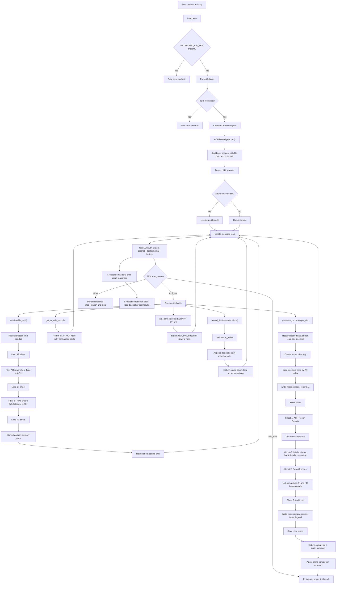

# ACH Reconciliation Flow

This project is an LLM-driven ACH reconciliation agent. The code does not hard-code matching rules; it loads raw AR and bank data, lets the model reason over the records, records decisions in batches, and then writes an Excel reconciliation report.



# Overview Diagram

```mermaid

flowchart TD

    A["Start: python main.py"] --> B["Load environment and validate input file"]

    B --> C["Create ACHReconAgent"]

    C --> D["Start LLM-driven reconciliation loop"]

    D --> E["initialize file and load workbook"]

    E --> F["Load AR ACH rows"]
    E --> G["Load JP ACH rows"]
    E --> H["Load FC bank rows"]

    F --> I["Agent reviews raw AR records"]
    G --> J["Agent reviews JP bank records"]
    H --> K["Agent reviews FC bank records"]

    I --> L["LLM compares AR and bank data"]
    J --> L
    K --> L

    L --> M{"For every AR record"}

    M --> N["Classify as MATCHED, PARTIAL, or UNMATCHED"]

    N --> O["Submit decisions in batches"]

    O --> P["Accumulate decisions in memory"]

    P --> Q{"All AR records decided?"}

    Q -- No --> L

    Q -- Yes --> R["Generate final report"]

    R --> S["Write ACH Recon Results sheet"]
    R --> T["Write Bank Orphans sheet"]
    R --> U["Write Audit Log sheet"]

    S --> V["Save Excel file"]
    T --> V
    U --> V

    V --> W["Return output path and audit summary"]

    W --> X["Print completion summary"]